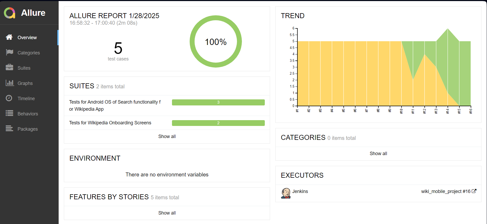
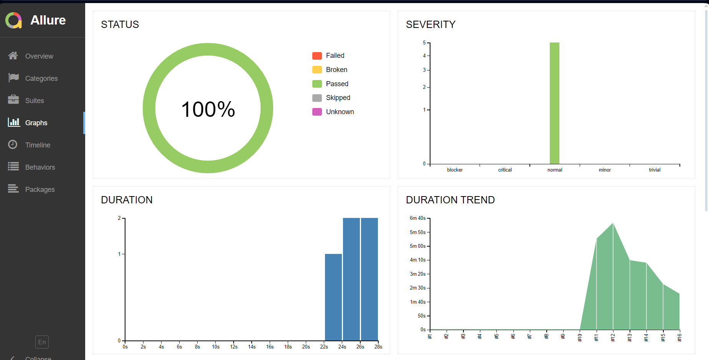
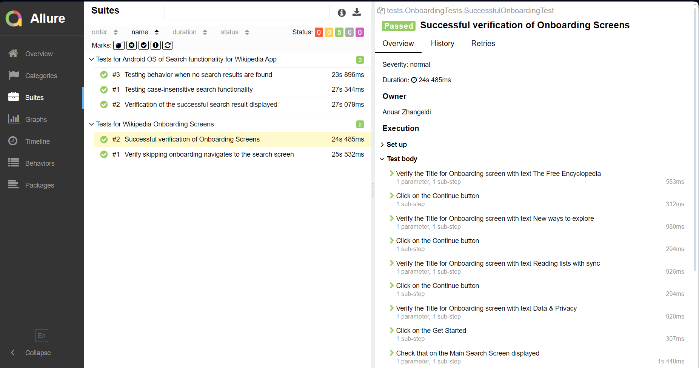
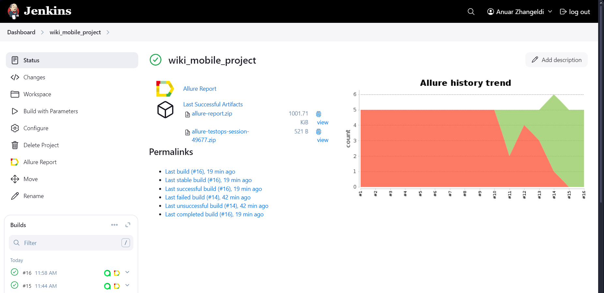
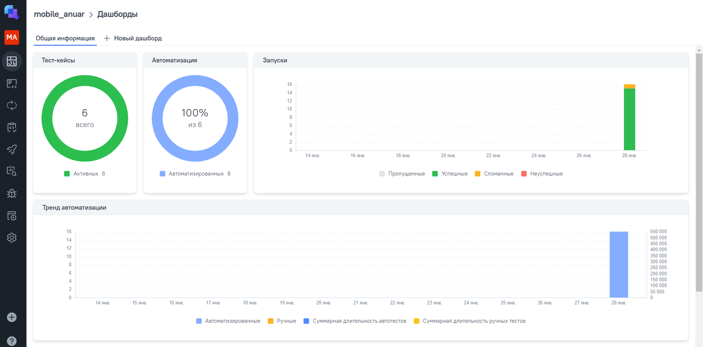
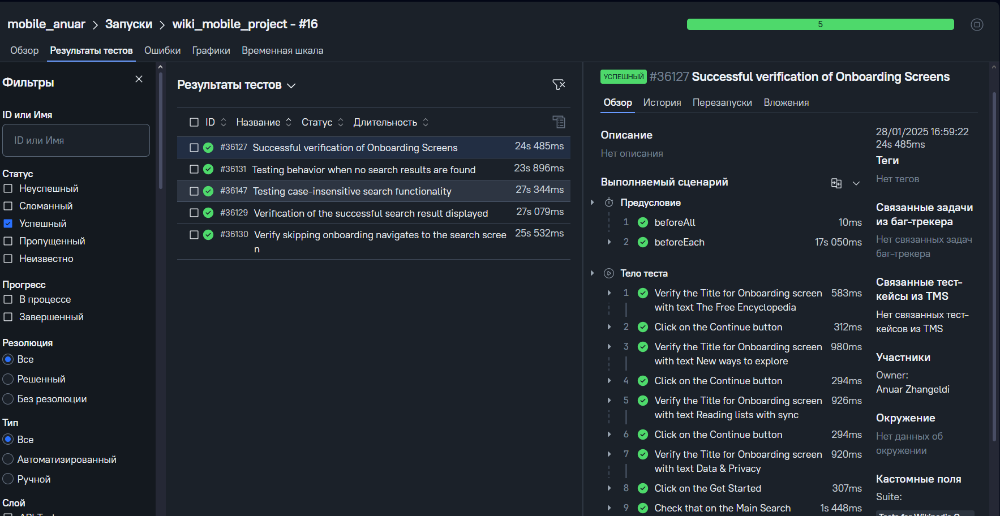
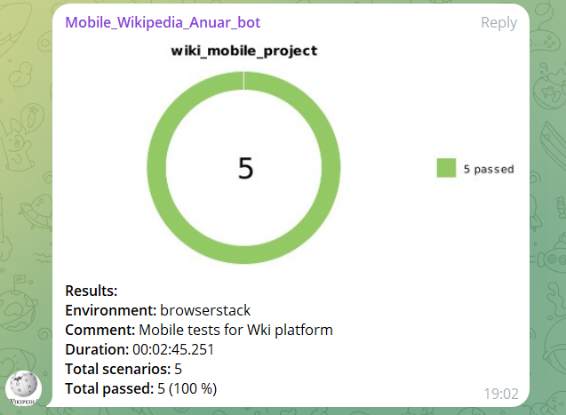

# Wiki Mobile Project 


## Project Overview
The Wiki Mobile Project is an automated testing framework designed for testing mobile applications.


## Technologies Used


---

## Agenda

1. **Test Automation Goals:** 
   
   - Verify the functionality and performance of the Wiki mobile app.
   - Ensure cross-platform compatibility.
   - Deliver detailed and actionable reports for stakeholders.

2. **Tool Integrations:**
   -  Allure Report for in-depth reporting with screenshots and logs.
   -  Jenkins for continuous integration and dashboard tracking.
   -  for centralized test management.
   -  Telegram Notifications for instant alerts.

3. **CI/CD Workflow:**
   - Code pushed to  **GitHub** triggers Jenkins pipelines.
   - Automated tests run on real or virtual Android devices via  **Appium**.
   - Results are published to **Allure TestOps** and **Jenkins** dashboards.
   - Notifications are sent to the configured **Telegram** channel.

---

## Test Cases
| Test Case ID | Test Description                                          |
|--------------|-----------------------------------------------------------|
| TC-001       | Successful verification of Onboarding Screens             |
| TC-002       | Verify skipping onboarding navigates to the search screen |
| TC-003       | Verification of the successful search result displayed    |
| TC-004       | Testing case-insensitive search functionality             |
| TC-005       | Testing behavior when no search results are found         |

---

## Jenkins Integration
**Jenkins Pipeline:**
- Link to Jenkins job: [Jenkins Wiki Mobile Project](https://jenkins.autotests.cloud/job/wiki_mobile_project/)


**Key Features:**
- Automated build and test execution triggered by GitHub events.
- Detailed build logs and test execution results.
- Dashboard with pass/fail trends and build duration metrics.

**Reporting:**
- Test execution data, including:
   - Screenshots of failures.
   - Error stack traces.
   - Metrics for execution time and success rates.
- Integrated with **Allure Reports** and **TestOps Dashboards**.

---

## Allure TestOps Integration
- Link to project: [Allure TestOps Wiki Mobile Project](https://allure.autotests.cloud/project/4583/)

**Highlights:**
- Centralized test management and result tracking.
- Real-time reporting with custom dashboards.
- Defect tracking and analysis for failed tests.

---

## Launch Settings
### Emulator
- Run tests on the emulator.
**- To run locally via the emulator, you will need to install and configure the emulator.**

### BrowserStack
- Run tests on BrowserStack.
- To run locally via BrowserStack, you will need to create an `auth.properties` file in `src/test/resources/` and specify your username and access key.

### Running Tests
- For Emulator:
  ```bash
  ./gradlew clean tests -DdeviceHost=emulation
  ```
- For BrowserStack (from Jenkins Project):
  ```bash
  ./gradlew clean tests -DdeviceHost=browserstack
  ```

---

## Reporting and Dashboards
### Allure Reports
- Captures screenshots, logs, and test metrics.
- View comprehensive reports locally or through the Jenkins job.
- Link to Allure Report: [Allure Report](https://jenkins.autotests.cloud/job/wiki_mobile_project/allure/)


**Allure Report Dashboard**




**Allure Report Graphs**




**Allure Report test cases**




### Jenkins Dashboards
- Displays build trends and real-time test results.
- Accessible at: [Jenkins Dashboard](https://jenkins.autotests.cloud/job/wiki_mobile_project/)

**Jenkins Project**




### TestOps Dashboards
- Advanced analytics with pass/fail trends and defect tracking.
- Project link: [TestOps Dashboard](https://allure.autotests.cloud/project/4583/)


**TestOps Dashboard**

- 

**TestOps test cases**

- 

---


## Telegram Notifications
- Configured to send test results and Jenkins build statuses.
- Notifications include:
    - Build success/failure status.
    - Summary of passed/failed tests.
    - Links to Allure dashboards for detailed insights.

- 
---

## Test Execution Video from BrowserStack

BrowserStack is employed for remote device testing and video recording.

It captures every test execution, enabling efficient debugging and offering a clear visual representation of the test steps.

* Test execution videos can be accessed through Jenkins or a designated server path.
* These videos provide critical insights into test execution flows and failures, making them an indispensable tool for test analysis.

**Example Test Execution Video:**


---